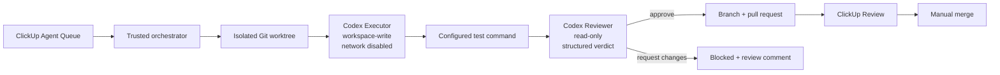

# Codex Executor + Reviewer + ClickUp pipeline

This repository contains a working orchestration layer for the double-agent design. It uses the ClickUp REST API as the queue adapter because a ClickUp MCP/plugin is not installed in this environment. The queue adapter is isolated in `ClickUpClient`, so it can be replaced with MCP later without changing the Executor, Reviewer, test, or pull-request stages.



## What is enforced

- Executor and Reviewer are separate, ephemeral `codex exec` sessions.
- Executor receives repository write access inside a dedicated worktree. Its shell network access and web search are disabled.
- Reviewer receives a read-only sandbox and reviews the uncommitted diff against the base branch.
- ClickUp and GitHub tokens are removed from the environment passed to both agents and to the test command. Model-generated shells use Codex's `core` environment with automatic secret-name exclusions.
- Live execution fails closed unless `AGENT_ISOLATED_RUNNER=true`. Set it only on a dedicated disposable runner with no personal browser, GitHub CLI, cloud CLI, or application credential stores. The flag is an operator attestation; it is not a substitute for runner isolation.
- The full configured test command runs between the two agents.
- Both agents return JSON validated against role-specific schemas.
- The candidate is staged and hashed before review. Reviewer reads the staged diff, and the pipeline refuses to commit if the index, tracked files, or untracked files change afterward.
- Executor changes to `AGENTS.md` or `.codex/` control files are rejected before Reviewer starts. Known orchestrator and Codex authentication values are scanned out of staged files.
- Only a passing test result plus an `approve` reviewer verdict can commit that exact staged tree, push a branch, and open a pull request.
- The pipeline never merges a pull request or deploys production.
- One process lock prevents overlapping queue consumers. The task moves out of the queue status before Codex starts.
- Only tasks with ClickUp priority **Urgent** (`1`) and the configured queue status (`to do`) are eligible. Priority and status are checked again before claiming; a manual task ID cannot bypass this rule. Other tasks are preserved.
- Per-task audit files are written under `.agent-runs/`; failed worktrees remain under `.agent-worktrees/` for inspection. Both paths are ignored by Git.

The Codex settings follow the official configuration values for `approval_policy` and `sandbox_mode`, and the automation uses the documented non-interactive `codex exec` mode with structured output. See [Codex configuration](https://learn.chatgpt.com/docs/config-file/config-reference) and [Codex non-interactive mode](https://learn.chatgpt.com/docs/non-interactive-mode).

## ClickUp setup

Create a dedicated list named `Agent Queue` and make sure these statuses exist, or map the environment variables to the names already used in the Workspace:

1. `to do`
2. `in progress`
3. `review`
4. `blocked`

Copy `.env.agent.example` to `.env.agent`, then set `CLICKUP_API_TOKEN` and `CLICKUP_LIST_ID`. `.env.agent` is ignored by Git. The list ID is the number after `/li/` in a copied ClickUp list URL.

The adapter uses the official endpoints to [list tasks](https://developer.clickup.com/reference/gettasks), [update a task](https://developer.clickup.com/reference/updatetask), and [create task comments](https://developer.clickup.com/reference/createtaskcomment). Keep each task self-contained:

```text
Title: Add checkout error recovery

Context:
- Affected route and user-visible symptom

Acceptance criteria:
- Expected behavior
- Error and empty states
- Required test or validation

Out of scope:
- Unrelated refactors
```

## Local verification

No ClickUp credential is needed for the included dry run:

```bash
./scripts/agent-pipeline.sh run \
  --task-file automation/codex_clickup/fixtures/sample-task.json \
  --dry-run
```

Check the machine before enabling the queue:

```bash
./scripts/agent-pipeline.sh doctor
./scripts/agent-pipeline.sh list
```

The doctor must find the repository, authenticated Codex and GitHub CLIs, ClickUp token, list ID, test command, and the isolated-runner attestation. Authenticate Codex and GitHub on the trusted runner before the first live task:

```bash
codex login
gh auth status
```

Use a dedicated disposable VM/container account for this runner, load ClickUp and GitHub credentials only into the orchestrator, and then set `AGENT_ISOLATED_RUNNER=true`. Do not set this flag on a personal workstation account that holds unrelated credentials.

Set a task's priority to **Urgent** and status to `to do`. Run the oldest eligible task:

```bash
./scripts/agent-pipeline.sh run
```

Run one known Urgent ClickUp task:

```bash
./scripts/agent-pipeline.sh run --task-id TASK_ID
```

## Installed GitHub runner

`.github/workflows/clickup-agent.yml` implements the queue using separate disposable Ubuntu jobs. The trusted `ci.py` helper runs from a checkout pinned to the workflow revision, with Python isolated mode. Executor and Reviewer use the pinned official Codex Action and its API-key proxy. Only the publisher has GitHub write permissions; ClickUp credentials are available only to preflight, claim, publish, and recovery steps.

Candidate code runs in Codex's workspace sandbox or a test container with no network, service credentials, Docker socket, host home, or Git metadata. Tests use dependencies installed from the trusted base manifest. Candidate patches, tests, and review results carry the same Git tree and patch hash. The publisher reconstructs and verifies those bytes, disables Git hooks, and never imports or executes candidate code. Changes to pipeline control files, workflow files, credential files, symlinks, and submodules are rejected.

Repository configuration:

| Type | Name | Purpose |
| --- | --- | --- |
| Actions secret | `CLICKUP_API_TOKEN` | ClickUp queue access |
| Actions secret | `OPENAI_API_KEY` | Codex model access via the official proxy |
| Actions variable | `CLICKUP_LIST_ID` | Queue list identifier |
| Actions variable | `CLICKUP_AGENT_ENABLED` | Explicit activation switch, defaults to `false` |
| Actions variables | `CLICKUP_QUEUE_STATUS`, `CLICKUP_WORKING_STATUS`, `CLICKUP_REVIEW_STATUS`, `CLICKUP_BLOCKED_STATUS` | Status mapping |

The configured list is **Eylül - DataProvido** (`1100380000031234`), with `to do`, `in progress`, `review`, and `blocked`. Existing `done` and `completed` statuses remain available. The ClickUp token is stored as an encrypted Actions secret, not in tracked files. Local `.env.agent` keeps its personal-workstation isolation flag disabled.

Run the read-only setup check with:

```bash
gh workflow run clickup-agent.yml --ref main -f mode=preflight
```

This verifies ClickUp access/statuses and reports missing configuration. A separate credential-free job installs the pinned Codex CLI and proxy, checks sandbox boundaries, builds the test image, and runs the base suite without network. It makes no model request and claims no task. A successful preflight workflow does **not** mean model authentication is configured; inspect the readiness checks.

To activate, add `OPENAI_API_KEY` to Actions secrets, enable `CLICKUP_AGENT_ENABLED`, and manually run a small dedicated Urgent queue task using `mode=run` and `task_id`. Confirm its actual Executor, tests, Reviewer, PR, and ClickUp transition before processing further tasks. Presence checks cannot establish that an API key has credit or model permissions; this first real run verifies them. The Actions repository setting allowing workflow-created pull requests must remain enabled.

The repository is public: workflow logs and development artifacts must be treated as public. Do not put credentials, customer data, or confidential material in queued tasks; artifacts are retained for one day. Use a private repository for confidential automation. The Mac's ChatGPT login is not uploaded. The [official Codex Action documentation](https://learn.chatgpt.com/docs/github-action) describes API-key authentication for this workflow.

## Scheduling and recovery

Periodic polling is disabled. Start the workflow manually with `mode=run` to process the oldest Urgent task in `to do`, or provide `task_id` for a particular eligible task. The GitHub runner executes independently of the Mac and Codex app. Workflow concurrency prevents overlapping queue consumers. Changing a task to Urgent does not itself trigger a run yet.

Recovery moves a claimed task to `blocked` when execution, tests, review, or publishing fails. A user-moved task is preserved. Recovery is best effort: a runner interruption before the claim artifact uploads or a ClickUp outage can leave a task `in progress`. Inspect the GitHub run before manually returning it to `to do`; do not blindly retry a task that may already have a branch or PR.

Automatic dispatch on a priority change requires a ClickUp webhook receiver; it is not installed. The receiver must verify ClickUp's signature and submit work through this same Urgent queue. See [ClickUp webhooks](https://developer.clickup.com/docs/webhooks).

## Operational flow

For every task, the pipeline:

1. Moves the ClickUp task to `in progress` and leaves a start comment.
2. Fetches the base branch and creates `agent/clickup-...` in an isolated worktree.
3. Runs Executor with repository write access and no shell network access.
4. Stages the candidate, rejects control-plane/credential changes, and records its Git tree hash.
5. Runs `AGENT_TEST_COMMAND` with ClickUp, GitHub, Codex, and application credentials removed; descendants are terminated with the command process group.
6. Runs Reviewer read-only against the staged candidate and checks that the tree hash is unchanged.
7. On approval, commits the exact reviewed index, pushes, opens a pull request, comments its URL in ClickUp, and moves the task to `review`.
8. On rejection or any caught failure, leaves the worktree for inspection, independently attempts the ClickUp comment and `blocked` transition, and records `outcome.json` plus any error trace.

Merge stays manual. Production deployment continues to follow the repository's existing main-branch deployment path after a human merges the pull request.
